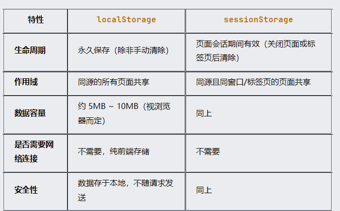

# store数据
 store数据默认刷新页面清空
 store数据持久化方案：
 将数据保存到 localStorage 中 或 sessionStorage 中
  sessionStorage 存储的数据，关闭页面后数据就会消失
  localStorage 存储的数据，关闭页面后数据不会消失

Web 开发中，localStorage 和 sessionStorage 是浏览器提供的两种客户端存储机制，它们都属于 Web Storage API，用于在浏览器端持久化保存数据。虽然它们的使用方式类似，但二者在 生命周期、作用域和适用场景 上有显著区别。

🧩 一、基本概念对比



🕒 二、生命周期差异详解
✅ localStorage
持久性：一旦写入，除非用户主动清除（如调用 localStorage.clear() 或清除浏览器缓存），否则数据一直存在。
跨页面通信：多个同源页面可以访问同一个 localStorage，适合用于用户登录状态、主题设置等长期有效的数据。
示例：购物车信息、用户偏好设置、记住密码功能等。
✅ sessionStorage
临时性：仅在当前会话中有效，当用户关闭浏览器标签页或窗口后，数据会被自动清除。
独立性：即使打开多个同源页面，每个页面的 sessionStorage 都是独立的。
示例：表单填写中途暂存、一次性验证码、临时 Token 缓存等。

# 使用插件来管理
```
安装插件 
npm install pinia-plugin-persistedstate 
```

```
在 main.ts 中引入并使用插件
const pinia = createPinia();
pinia.use(piniaPluginPersistedstate)
app.use(pinia)
```

```
配置需要持久化的store，见 shop.ts
    //默认方式
     persist: true //启用持久化

    //指定key、存储方式
     persist: {
         storage: sessionStorage, // 使用 session 存储
         key: 'my_shop_key'        // 自定义 localStorage 键名
    }

    //指定key、存储方式、筛选数据
    persist: {
        storage: localStorage,
        getItemKey: (id) => `shopStore_${id}`, // 自定义 key 名，此api已经失效，推荐使用  key: 'my_shop_key'
        filter: ({ store }) => {
            return {
                shop: store.shop
            }
        }
    }
```

